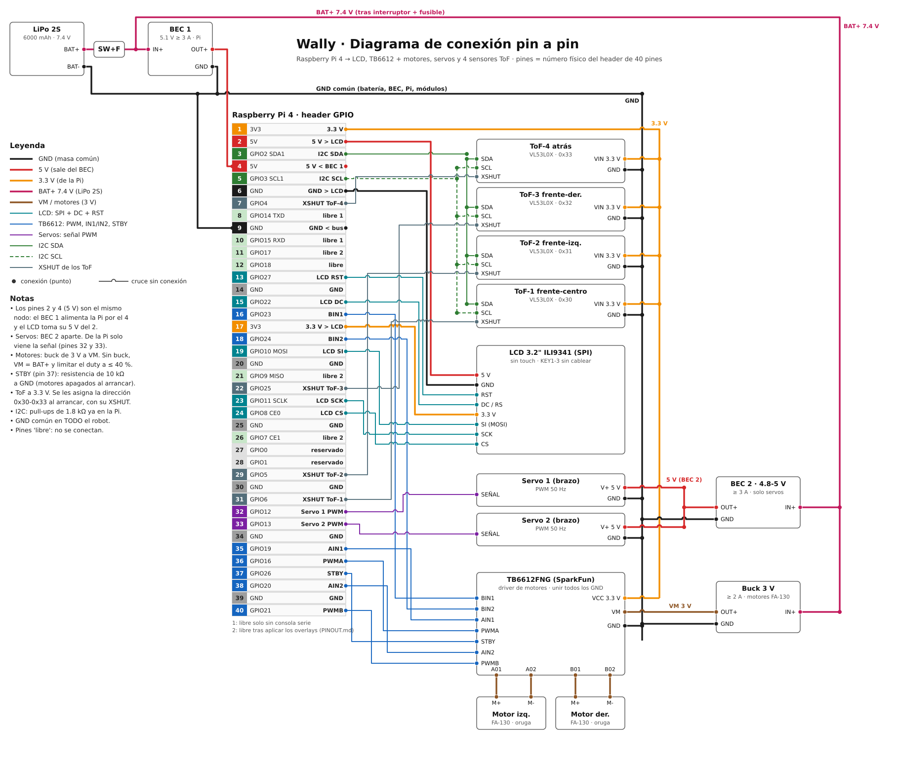

# Pinout de Wally

v3 — 2026-09-21. Supone el LCD conectado **por cables** (8 hilos) y **sin touch**.
Numeración: "Pin" = pin físico del header de 40 pines; "GPIO" = numeración BCM. Es lo que se usa en el código.

**Estado del LCD hoy:** sigue enchufado directo a la Pi, con `dtoverlay=tft9341:rotate=0` aplicado. El framebuffer es **vertical 240×320** y la orientación quedó confirmada con [lcd_orient.py](scripts/lcd_orient.py). La migración a cables (secciones 4.1 y 8) sigue pendiente.

## 1. Resumen

| Bloque | GPIO | Cant. |
|---|---|---|
| LCD (SPI0 + DC + RST) | 8, 10, 11, 22, 27 | 5 |
| I2C1 hardware (4×ToF, y luego ADS1115, IMU…) | 2, 3 | 2 |
| Motores TB6612FNG | 16, 19, 20, 21, 23, 24, 26 | 7 |
| Servos (brazos) | 12, 13 | 2 |
| XSHUT de los 4 ToF | 4, 5, 6, 25 | 4 |
| **Usados** | | **20** |
| **Libres** | 7, 9, 14, 15, 17, 18 (ver sección 7) | **6** |
| Reservados | 0, 1 (EEPROM de HATs) | 2 |

Los GPIO 2–27 son 26 pines: 20 usados + 6 libres.

## 2. Diagrama de conexión



Archivos: [docs/wiring.svg](docs/wiring.svg) (vectorial, se puede ampliar sin perder calidad) y [docs/wiring.png](docs/wiring.png) (imagen, para verla en el celular).

**Cómo leerlo:**

- **Tira central:** los 40 pines de la Pi en orden. Cada cable sale del borde del pin correspondiente hacia la terminal del módulo. Los pines verdes claros son los libres.
- **Líneas gruesas = potencia, cada una de su color:** GND en negro, 5 V del BEC en rojo, 3.3 V de la Pi en naranja, BAT+ 7.4 V en magenta, VM de los motores en marrón.
- **Líneas finas = señales:** LCD turquesa, motores azul, servos morado, I2C verde (SCL punteado) y XSHUT gris.
- **Puntos = conexión.** Un arco donde un cable pasa sobre otro = cruce **sin** conexión.
- **Fuentes de 5 V:** el BEC 1 alimenta la Pi (por el pin 4) y el BEC 2 solo los servos. El diagrama muestra la arquitectura recomendada en [PLAN.md](PLAN.md) §4. Si solo tienes un BEC, mira la sección 6.

Para cambiar un pin: edita la tabla `PINS` (y los bloques de dispositivos) en [docs/make_wiring_svg.py](docs/make_wiring_svg.py) y ejecuta `python3 docs/make_wiring_svg.py`. Eso regenera el SVG y la lista de cables de la sección 5. El PNG se renderiza aparte.

## 3. Mapa del header (40 pines)

Columna izquierda = pines impares, derecha = pares (la Pi con el header hacia arriba).

| Pin | GPIO | Uso | | Pin | GPIO | Uso |
|---|---|---|---|---|---|---|
| 1 | 3V3 | Riel 3V3 (ToF, VCC del TB6612) | | 2 | 5V | **LCD** 5V |
| 3 | GPIO2 (SDA1) | **I2C SDA** | | 4 | 5V | **entrada de 5 V desde el BEC 1** |
| 5 | GPIO3 (SCL1) | **I2C SCL** | | 6 | GND | **LCD** GND |
| 7 | GPIO4 | **XSHUT ToF-4** | | 8 | GPIO14 (TXD) | libre ¹ |
| 9 | GND | GND (retorno al bus de GND) | | 10 | GPIO15 (RXD) | libre ¹ |
| 11 | GPIO17 | libre ² | | 12 | GPIO18 | **libre** |
| 13 | GPIO27 | **LCD RST** | | 14 | GND | GND |
| 15 | GPIO22 | **LCD DC (RS)** | | 16 | GPIO23 | **TB6612 BIN1** |
| 17 | 3V3 | **LCD** 3V3 | | 18 | GPIO24 | **TB6612 BIN2** |
| 19 | GPIO10 (MOSI) | **LCD SI** | | 20 | GND | GND |
| 21 | GPIO9 (MISO) | libre ² | | 22 | GPIO25 | **XSHUT ToF-3** |
| 23 | GPIO11 (SCLK) | **LCD SCK** | | 24 | GPIO8 (CE0) | **LCD CS** |
| 25 | GND | GND | | 26 | GPIO7 (CE1) | libre ² |
| 27 | GPIO0 | reservado (ID EEPROM) | | 28 | GPIO1 | reservado (ID EEPROM) |
| 29 | GPIO5 | **XSHUT ToF-2** | | 30 | GND | GND |
| 31 | GPIO6 | **XSHUT ToF-1** | | 32 | GPIO12 | **Servo 1** (señal) |
| 33 | GPIO13 | **Servo 2** (señal) | | 34 | GND | GND |
| 35 | GPIO19 | **TB6612 AIN1** | | 36 | GPIO16 | **TB6612 PWMA** |
| 37 | GPIO26 | **TB6612 STBY** | | 38 | GPIO20 | **TB6612 AIN2** |
| 39 | GND | GND | | 40 | GPIO21 | **TB6612 PWMB** |

¹ Libres solo si se apaga la consola serie (sección 7).
² Libres solo después de aplicar los overlays de la sección 8. Hasta entonces los reclama el driver del touch / SPI.

Los pines GND son todos el mismo nodo. Como el header tiene pocos, conviene un **bus de GND y de 3V3/5V** (bornera o placa perforada) al que se conecta todo.

## 4. Cableado por dispositivo

### 4.1 LCD 3.2" (8 hilos, "pin N ↔ pin N")

Pinout del conector de 26 pines según el [wiki del fabricante](https://www.lcdwiki.com/3.2inch_RPi_Display). Se conecta el mismo número de pin del LCD al mismo número de pin del header de la Pi:

| Pin LCD | Señal LCD | → Pin Pi | GPIO |
|---|---|---|---|
| 17 | 3.3V | 17 | 3V3 |
| 2 | 5V | 2 | 5V |
| 6 | GND | 6 | GND |
| 13 | RST | 13 | GPIO27 |
| 15 | LCD_RS (DC) | 15 | GPIO22 |
| 19 | LCD_SI | 19 | GPIO10 (MOSI) |
| 23 | LCD_SCK | 23 | GPIO11 (SCLK) |
| 24 | LCD_CS | 24 | GPIO8 (CE0) |

**No cablear:**
- Pines 11, 21, 26: son el touch (TP_IRQ, TP_SO, TP_CS).
- Pines 12, 16, 18: son botones KEY1–3 de la placa (GPIO18/23/24). Si se cablean, chocan con TB6612 BIN1/BIN2.
- Pines 3, 5, 7, 8, 10, 22: no están conectados en el LCD.

**Alimentación:** el wiki lista 3.3 V (pines 1 y 17) y 5 V (pines 2 y 4) como entradas de alimentación, sin decir cuál usa cada parte. Cablear ambos (uno de cada) reproduce las condiciones de cuando la placa iba enchufada. El backlight no tiene control por GPIO: siempre encendido.

**Señal:** cables cortos (< 15 cm) y con el GND pegado a las señales. Si aparecen artefactos o líneas, bajar la velocidad SPI (parámetro `speed`).

**Orientación:** el panel está montado de modo que `rotate=0` deja la imagen derecha (framebuffer **vertical 240×320**). Los valores `90`/`270` dan apaisado y `180` da vertical de cabeza. Si algún día se cambia el montaje físico, se repite la prueba con [lcd_orient.py](scripts/lcd_orient.py). La cara de Wally debe diseñarse para pantalla vertical.

### 4.2 Driver de motores TB6612FNG (SparkFun)

| TB6612 | → GPIO | Pin | Notas |
|---|---|---|---|
| PWMA | GPIO16 | 36 | Oruga izquierda (intercambiable en `config.toml`) |
| AIN1 | GPIO19 | 35 | |
| AIN2 | GPIO20 | 38 | |
| PWMB | GPIO21 | 40 | Oruga derecha |
| BIN1 | GPIO23 | 16 | |
| BIN2 | GPIO24 | 18 | |
| STBY | GPIO26 | 37 | Paro de emergencia por hardware. Ponerle una resistencia de ~10 kΩ a GND |
| VCC | 3V3 | | Lógica |
| GND | GND | | Común con todo (unir todos los GND del módulo) |
| VM | Buck de 3 V | | Ver sección 6 (los FA-130 son de 3 V) |
| A01 / A02 | Motor izquierdo | | |
| B01 / B02 | Motor derecho | | |

Todos estos GPIO son de la familia 9–27, que arrancan en **pull-down**, así que los motores no se mueven durante el arranque de la Pi.

### 4.3 Servos (brazos)

| Servo | Señal → GPIO | Pin | Alimentación |
|---|---|---|---|
| Brazo 1 | GPIO12 | 32 | 4.8–5 V del BEC 2 (no de la Pi) |
| Brazo 2 | GPIO13 | 33 | |

GND del BEC 2 unido al GND de la Pi. GPIO12/13 son los dos únicos pines con PWM por hardware, así que sirven con cualquiera de las opciones de PWM de la sección 9. La señal de 3.3 V normalmente basta para servos a 4.8 V; se confirma en la prueba de la fase 5.

### 4.4 Sensores ToF VL53L0X (×4)

Modelo confirmado: **VL53L0X** (módulo con serigrafía `VL53L0/1XV2`, alcance útil ~3–120 cm). El módulo tiene 6 pines: `VIN`, `GND`, `SCL`, `SDA`, `GPIO1` y `XSHUT`. Se usan cinco; **`GPIO1` (salida de interrupción) queda sin conectar**, porque el software lee por sondeo.

Todos van en paralelo al mismo bus I2C1 (GPIO2/3, pines 3 y 5). De fábrica todos responden en **0x29**, así que al arrancar el software los apaga con su XSHUT, los enciende uno por uno y les reasigna la dirección:

| Sensor | XSHUT → GPIO | Pin | Dirección tras el arranque | Nombre en `config.toml` |
|---|---|---|---|---|
| ToF-1 (frente-centro) | GPIO6 | 31 | 0x30 | `front` |
| ToF-2 (frente-izquierda) | GPIO5 | 29 | 0x31 | `front_left` |
| ToF-3 (frente-derecha) | GPIO25 | 22 | 0x32 | `front_right` |
| ToF-4 (atrás) | GPIO4 | 7 | 0x33 | `rear` |

(Posiciones = sugerencia, pendiente de tu decisión: el código las trata así, los tres frontales limitan el avance y el trasero limita la reversa.)

- **Cables por sensor:** VIN → 3.3 V, GND → GND, SDA y SCL en paralelo con los demás, XSHUT → su GPIO. No conectes `GPIO1`.
- **Instalas menos de 4:** lista solo los que tengas en `tof.sensors` (por ejemplo `["front"]`). Los XSHUT de los demás se mantienen bajos.
- **Un sensor listado que falla bloquea su dirección** (fail-safe). Si no lo instalaste, no lo listes.
- Otros dispositivos I2C previstos, en el mismo bus: ADS1115 para el monitor de batería (0x48) o un IMU MPU6050 (0x68). **No consumen pines.**
- La cámara usa su propio bus (`i2c0mux`), no choca con este.
- Alimenta los ToF a **3.3 V** (VIN admite 3.3 V tanto si el módulo trae regulador como si no). A 5 V, las pull-ups de SDA/SCL del módulo podrían subir la línea a 5 V y dañar la Pi.
- **XSHUT:** el software lo maneja como salida (bajo = apagado, alto = encendido) a 3.3 V, que es lo que admite el sensor. No lo sueltes al aire: sin pull-up en tu módulo quedaría indefinido.
- Puesta en marcha: `.venv/bin/python scripts/tof_test.py` enciende los sensores, asigna direcciones y muestra las distancias en vivo (pon la mano frente a cada uno: solo debe cambiar su columna).
- La Pi ya trae pull-ups de 1.8 kΩ a 3.3 V en GPIO2/3.

## 5. Lista de cables

Generada por [docs/make_wiring_svg.py](docs/make_wiring_svg.py) a partir de los mismos datos que el diagrama. No editar a mano: se sobrescribe. "GND común" es el bus de GND (bornera) al que llegan la batería, los BEC, la Pi y todos los módulos.

<!-- CABLES:BEGIN -->

**Alimentación y masa**

| # | Desde | Hasta | Color | Nota |
|---|---|---|---|---|
| 01 | LiPo 2S BAT+ | interruptor + fusible → IN+ del BEC 1, BEC 2 y Buck 3 V | magenta | cable grueso (≥ 18 AWG) |
| 02 | LiPo 2S BAT− | GND común | negro |  |
| 03 | BEC 1 OUT+ | pin 4 (5V) | rojo | alimenta la Pi; no conectar a la vez el USB-C |
| 04 | BEC 1 GND | GND común | negro |  |
| 05 | pin 9 (GND) | GND común | negro | masa de la Pi |
| 06 | BEC 2 OUT+ | Servo 1 V+ y Servo 2 V+ | rojo | solo servos |
| 07 | BEC 2 GND | GND común | negro |  |
| 08 | Buck 3 V OUT+ | TB6612 VM | marrón | o VM = BAT+ con duty ≤ 40 % |
| 09 | Buck 3 V GND | GND común | negro |  |
| 10 | GND de ToF-1 a ToF-4 | GND común | negro | 4 cables |
| 11 | GND de Servo 1 y Servo 2 | GND común | negro | 2 cables |
| 12 | TB6612 GND | GND común | negro | unir todos los GND del módulo |

**Desde el header de la Pi**

| # | Desde | Hasta | Color | Nota |
|---|---|---|---|---|
| 13 | pin 1 (3V3) | riel 3.3 V: VIN de los 4 ToF + VCC del TB6612 | naranja | también sirve el pin 17 |
| 14 | pin 2 (5V) | LCD 5 V | rojo | 5 V del BEC 1 (mismo nodo que el pin 4) |
| 15 | pin 3 (GPIO2 SDA1) | SDA de los 4 ToF (en paralelo) | verde |  |
| 16 | pin 5 (GPIO3 SCL1) | SCL de los 4 ToF (en paralelo) | verde punteado |  |
| 17 | pin 6 (GND) | LCD GND | negro | masa del LCD |
| 18 | pin 7 (GPIO4) | ToF-4 XSHUT | gris |  |
| 19 | pin 13 (GPIO27) | LCD RST | turquesa |  |
| 20 | pin 15 (GPIO22) | LCD DC / RS | turquesa |  |
| 21 | pin 16 (GPIO23) | TB6612 BIN1 | azul |  |
| 22 | pin 17 (3V3) | LCD 3.3 V | naranja | 3.3 V del LCD |
| 23 | pin 18 (GPIO24) | TB6612 BIN2 | azul |  |
| 24 | pin 19 (GPIO10 MOSI) | LCD SI (MOSI) | turquesa |  |
| 25 | pin 22 (GPIO25) | ToF-3 XSHUT | gris |  |
| 26 | pin 23 (GPIO11 SCLK) | LCD SCK | turquesa |  |
| 27 | pin 24 (GPIO8 CE0) | LCD CS | turquesa |  |
| 28 | pin 29 (GPIO5) | ToF-2 XSHUT | gris |  |
| 29 | pin 31 (GPIO6) | ToF-1 XSHUT | gris |  |
| 30 | pin 32 (GPIO12) | Servo 1 SEÑAL | morado |  |
| 31 | pin 33 (GPIO13) | Servo 2 SEÑAL | morado |  |
| 32 | pin 35 (GPIO19) | TB6612 AIN1 | azul |  |
| 33 | pin 36 (GPIO16) | TB6612 PWMA | azul |  |
| 34 | pin 37 (GPIO26) | TB6612 STBY | azul | + resistencia 10 kΩ a GND |
| 35 | pin 38 (GPIO20) | TB6612 AIN2 | azul |  |
| 36 | pin 40 (GPIO21) | TB6612 PWMB | azul |  |

**Salidas de motor**

| # | Desde | Hasta | Color | Nota |
|---|---|---|---|---|
| 37 | TB6612 A01 | Motor izq. M+ | marrón |  |
| 38 | TB6612 A02 | Motor izq. M− | marrón |  |
| 39 | TB6612 B01 | Motor der. M+ | marrón |  |
| 40 | TB6612 B02 | Motor der. M− | marrón |  |

Total: 40 cables.
<!-- CABLES:END -->

## 6. Alimentación

| Fuente | Alimenta | Notas |
|---|---|---|
| **LiPo 2S** 7.4 V (8.4 V llena) | Los tres conversores, por un interruptor + fusible | No bajar de 6.0 V |
| **BEC 1**, 5.1 V ≥ 3 A | Raspberry Pi (pin 4) y, por el mismo nodo de 5 V del header, el LCD (pin 2) | Dedicado a la Pi |
| **BEC 2**, 4.8–5 V ≥ 3 A | Solo los 2 servos | Separado, para que un servo en stall no tumbe la Pi |
| **Buck 3 V** ≥ 2 A | VM del TB6612 (motores FA-130, de 3 V) | Sin buck: VM = BAT+ y limitar el duty a ≤ 40 % en software |
| **3.3 V de la Pi** (pines 1 y 17) | 4 ToF, VCC del TB6612 y la lógica del LCD | Consumo bajo (estimado ~100–150 mA, a confirmar con las hojas de tus módulos) |

- **GND común:** batería, BEC 1, BEC 2, buck, Pi y todos los módulos comparten masa. Sin eso las señales no tienen referencia.
- **Alimentar la Pi por el pin 4** salta las protecciones del USB-C. Usa un BEC de calidad con protección de sobrecorriente y **nunca conectes a la vez el USB-C y el pin 4**.
- **Un solo BEC:** si solo tienes uno de ≥ 5 A, puede alimentar Pi y servos, pero los picos de los servos pueden reiniciar la Pi. Es más seguro separarlos, como en el diagrama.
- El monitor de batería (ADS1115, fase 9) va por I2C y no cambia este cableado.

## 7. Pines libres y cómo se liberan

| GPIO | Pin | Estado | Qué hace falta |
|---|---|---|---|
| **18** | 12 | Libre **ya** | Nada. Sirve como reloj I2S si se agrega un amplificador digital más adelante |
| **7** | 26 | Se libera | `dtoverlay=spi0-1cs` (deja solo CE0) |
| **9** | 21 | Se libera | `no_miso` en el mismo overlay (el LCD no usa MISO) |
| **17** | 11 | Se libera | Overlay `wally-lcd` (sin el nodo del touch) |
| **14, 15** | 8, 10 | Se liberan | Quitar `console=serial0,115200` de `cmdline.txt` y `enable_uart=1` de `config.txt`. Es la consola serie de depuración, así que solo si no la quieres |

**Total: 1 libre hoy, 4 tras los overlays, 6 si también se apaga la consola serie.**

Para **más sensores**: los que van por I2C no gastan pines. Si los nuevos son digitales (p. ej. HC-SR04: 2 pines cada uno, y su ECHO es de 5 V, necesita divisor), alcanza para 2–3.
Si hicieran falta más, un multiplexor I2C TCA9548A (~US$2) permite a los 4 ToF compartir la dirección 0x29 y libera los 4 pines XSHUT.

**Conflicto a tener presente:** un amplificador I2S futuro usaría GPIO18, 19 y 21. Los GPIO19 y 21 están en el motor; moverlos a 7/17 es un cambio de una línea en `config.toml`.

## 8. Cambios de software que acompañan el recableado

**Hoy** (`/boot/firmware/config.txt`): `dtoverlay=tft9341:rotate=0` y `dtparam=spi=on`, con el LCD enchufado. Es la configuración de LCD-show con la rotación corregida.

Preparados y **validados en seco, no aplicados**:

- [system/wally-lcd-overlay.dts](system/wally-lcd-overlay.dts): es el overlay `tft9341` de LCD-show sin el nodo del touch. Mismos pines y mismo `bgr`. Su rotación por defecto es **0**.
- [system/wally-lcd.dtbo](system/wally-lcd.dtbo): compilado con `dtc -@`. Acepta los parámetros `rotate`, `speed`, `fps`, `txbuflen` y `debug`.

Cambios en `/boot/firmware/config.txt` (respaldar antes):

```
# quitar / comentar:
#dtparam=spi=on
#dtoverlay=tft9341:rotate=0

# agregar:
dtoverlay=spi0-1cs,no_miso
dtoverlay=wally-lcd,rotate=0
```

**Procedimiento recomendado en dos etapas** (cambia una variable a la vez):

1. **Etapa A, LCD todavía enchufado:**
   ```
   sudo cp /boot/firmware/config.txt /boot/firmware/config.txt.bak-antes-wally-lcd
   sudo cp ~/Robok/system/wally-lcd.dtbo /boot/firmware/overlays/
   sudo nano /boot/firmware/config.txt    # aplicar los cambios de arriba
   sudo reboot
   ```
   Verificar que la cara sigue apareciendo y derecha (`python3 scripts/lcd_test.py` y `python3 scripts/lcd_orient.py`), y que los GPIO 7, 9 y 17 quedan libres (`gpioinfo | grep -E '"GPIO(7|9|17)"'` no debe mostrar consumidor).
2. **Etapa B:** `sudo poweroff`, desenchufar el LCD, cablear los 8 hilos de la sección 4.1, encender y repetir las pruebas.

**Rollback:** restaurar `config.txt.bak-antes-wally-lcd` y volver a enchufar el LCD.

> El respaldo `config.txt.bak-lcdshow` que ya existe es la configuración de LCD-show **original, con `rotate=270`** (orientación equivocada para este montaje). Sirve para volver al punto de partida, pero al restaurarlo hay que volver a poner `rotate=0`.

> Si el LCD se cablea sin cambiar el overlay, el driver del touch se queda escuchando GPIO17 sin nada conectado. Es probable que lea "tocando" de forma constante (no verificado). Por eso conviene la Etapa A primero.

## 9. PWM de servos y motores (decisión pendiente)

`pigpiod` no existe en Trixie. Con pines de sobra, las opciones son:

| Opción | Cómo | Pros | Contras |
|---|---|---|---|
| **A. pigpio compilado desde fuente** | Daemon con DMA, PWM/servo en cualquier GPIO | Es tu stack original. Sin jitter aunque la CPU esté al 100 % | Proyecto sin mantenimiento (v79, 2021). **Falta probar que compila** en Trixie/gcc 14 con kernel 6.18 |
| **B. Sin pigpio** | Servos con PWM hardware en GPIO12/13 (`dtoverlay=pwm-2chan`) + PWM por software de `lgpio` para los motores | Todo desde apt | Posible interacción con el audio del jack (reloj PWM). Se prueba en la fase 3 |
| **C. PCA9685** | Servos por I2C | Independiente de la CPU | Hardware extra; ya no hace falta por pines |

**Estado (fase 3):** el software de motores ya usa el PWM por software de `lgpio` (variante de la opción B, sin PWM por hardware), que funciona con lo instalado y no exige compilar nada. Se mide su jitter en la puesta en marcha. Si molesta, se prueba la opción A. El driver está detrás de una interfaz (`GpioBackend`), así que cambiar de backend no toca el resto.

**Recomendación:** medir primero el `lgpio` actual; si no convence, probar A (~15 minutos).
Los pines ya están elegidos para que sirvan con cualquiera.

## 10. Estado de verificación

**Verificado (en la Pi, por ti, o en la documentación del fabricante):**
- LCD con `rotate=0`: framebuffer 240×320, imagen derecha (confirmado visualmente con `lcd_orient.py`).
- Pines que usa hoy el LCD: GPIO 7, 8, 9, 10, 11, 17, 22, 27 (por `gpioinfo` y por el overlay decompilado).
- Pinout del conector de 26 pines (wiki del fabricante).
- Pines 3, 5, 7, 8, 10 y 22 del conector del LCD sin conexión (wiki).
- `spi0-1cs,no_miso` existe en este kernel.
- Pull-down por defecto de GPIO 9–27 (`pinctrl`).
- `wally-lcd.dtbo` compila y pasa el dry-run contra el device tree real. `rotate` (incluido el valor por defecto 0) y `speed` se aplican, y no queda referencia al touch.
- El diagrama se renderizó y se revisó visualmente.

**Pendiente (necesita hardware o un reinicio):**
- Que tras aplicar los overlays GPIO 7, 9 y 17 queden realmente libres.
- Calidad de la señal SPI con cables. Ver si aguanta 16 MHz y si `speed=32000000` da imagen limpia (32 MHz ≈ 38 ms por cuadro, unos 26 fps teóricos).
- Cuál de 3.3 V o 5 V necesita realmente el LCD. Se cablean ambos.
- Que pigpio compile.
- Cablear los 4 ToF y correr `scripts/tof_test.py` (hoy el bus I2C1 no ve ningún dispositivo).
- Cuántos BEC tienes y de qué corriente (el diagrama supone 2 BEC + un buck de 3 V).
